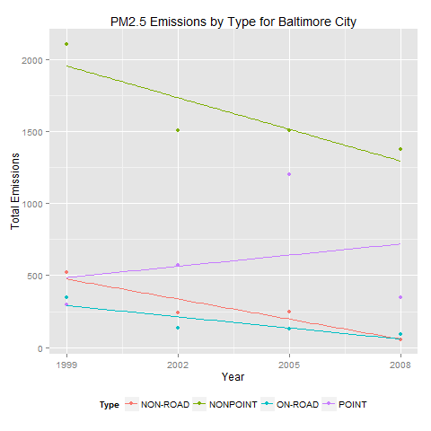

exdata-006_courseproject2
=========================

Code and resulting plots related to Course Project 2 for Coursera course Exploratory Data Analysis

### Overview of Course Project 2
The goal of Course Project 2 is to explore the National Emissions Inventory database, examining fine particulate matter pollution in the United States over the 10-year period from 1999 through 2008.  The following questions have been posed (which have been quoted directly from the Course Project 2 submission page):

1.  Have total emissions from PM2.5 decreased in the United States from 1999 to 2008? Using the **base** plotting system, make a plot showing the *total* PM2.5 emission from all sources for each of the years 1999, 2002, 2005, and 2008.
2.  Have total emissions from PM2.5 decreased in the **Baltimore City**, Maryland (fips == "24510") from 1999 to 2008?  Use the **base** plotting system to make a plot answering this question.
3.  Of the four types of sources indicated by the type (point, nonpoint, onroad, nonroad) variable, which of these four sources have seen decreases in emissions from 1999-2008 for **Baltimore City**?  Which have seen increases in emissions from 1999-2008?  Use the **ggplot2** plotting system to make a plot answer this question.
4.  Across the United States, how have emissions from coal combustion-related sources changed from 1999-2008?
5.  How have emissions from motor vehicle sources changed from 1999-2008 in **Baltimore City**?
6.  Compare emissions from motor vehicle sources in Baltimore City with emissions from motor vehicle sources in **Los Angeles County**, California (fips == "06037").  Which city has seen greater changes over time in motor vehicle emissions?

### Overview of files included
- README.md
    - This file
- plot1.png
    - The plot result created by executing the **plot1()** function in *plot1.r*
    - This plot is saved to be 480 x 480 px
- plot1.r
    - This file contains the main function **plot1()** for question 1 of Course Project 2
- plot2.png
    - The plot result created by executing the **plot2()** function in *plot2.r*
    - This plot is saved to be 480 x 480 px
- plot2.r
    - This file contains the main function **plot2()** for question 2 of Course Project 2
- plot3.png
    - The plot result created by executing the **plot3()** function in *plot3.r*
    - This plot is saved to be 480 x 480 px
- plot3.r
    - This file contains the main function **plot3()** for question 3 of Course Project 2
- plot4.png
    - The plot result created by executing the **plot4()** function in *plot4.r*
    - This plot is saved to be 480 x 480 px
- plot4.r
    - This file contains the main function **plot4()** for question 4 of Course Project 2
- plot5.png
    - The plot result created by executing the **plot5()** function in *plot5.r*
    - This plot is saved to be 480 x 480 px
- plot5.r
    - This file contains the main function **plot5()** for question 5 of Course Project 2
- plot6.png
    - The plot result created by executing the **plot6()** function in *plot6.r*
    - This plot is saved to be 480 x 960 px
- plot6.r
    - This file contains the main function **plot6()** for question 6 of Course Project 2
- readRDSFile.r
    - This file contains the helper function **readRDSFile()** which is used to download and unzip (if necessary), and read the data file of interest
    
### Overview of Part One
Plot 1 can be seen below.  
  
This plot shows that Total PM2.5 Emissions in the United States have been decreasing over the time period from 1999 through 2008.  

This plot was created using the *plot1.r* file found in this repository.  The fundamental flow of the program follows this basic algorithm:

1. Call the *readRDSFile()* function from the **readRDSFile.r** file found in this repository.
    - This file will check to see if the file to be read (*summarySCC_PM25.rds*) exists.  If it does not exist it is downloaded and unzipped.  Then the file is read into memory.
2. The emissions are summed for each year using the *aggregate()* function.
3. The results are plotted using the *PNG_Plot1()* function found in the **plot1.r** file.
    - This function saves the plot as a PNG file in the *./code* subfolder (relative to the working directory).
    - The *base* plotting system was used to create the final plot.
    
### Overview of Part Two
Plot 2 can be seen below.  
  
This plot shows that Total PM2.5 Emissions in Baltimore City have been decreasing over the time period from 1999 through 2008.  

This plot was created using the *plot2.r* file found in this repository.  The fundamental flow of the program follows this basic algorithm:

1. Call the *readRDSFile()* function from the **readRDSFile.r** file found in this repository.
    - This file will check to see if the file to be read (*summarySCC_PM25.rds*) exists.  If it does not exist it is downloaded and unzipped.  Then the file is read into memory.
2. The data is subset for **Baltimore City** (fips = 24510).
3. The emissions are summed for each year using the *aggregate()* function.
4. The results are plotted using the *PNG_Plot2()* function found in the **plot2.r** file.
    - This function saves the plot as a PNG file in the *./code* subfolder (relative to the working directory).
    - The *base* plotting system was used to create the final plot.
    
### Overview of Part Three
Plot 3 can be seen below.  
  
This plot shows that in Baltimore City - Nonpoint, Non-road, and On-road types of PM2.5 Emissions have been decreasing over the time period from 1999 through 2008; however, Point types of PM2.5 Emissions have been increasing over the same time period in Baltimore City.

The author considered plotting these as multiple plots; however, felt displaying the data on the same set of axes made for a more powerful analysis/conclusion.

This plot was created using the *plot3.r* file found in this repository.  The fundamental flow of the program follows this basic algorithm:

1. Call the *readRDSFile()* function from the **readRDSFile.r** file found in this repository.
    - This file will check to see if the file to be read (*summarySCC_PM25.rds*) exists.  If it does not exist it is downloaded and unzipped.  The the file is read into memory.
2. The data is subset for **Baltimore City** (fips = 24510).
3. The emissions are summed for each *year* and *type* using the *aggregate()* function.
4. The results are plotted using the *PNG_Plot3()* function found in the **plot3.r** file.
    - This function saves the plot as a PNG file in the *./code* subfolder (relative to the working directory).
    - The *ggplot2* plotting system was used to create the final plot.
    
### Overview of Part Four
Plot 4 can be seen below.  
  
This plot shows that coal combustion-related sources of PM2.5 emissions in the United States have been decreasing over the time period from 1999 through 2008.  

The author considered displaying the different types of coal combustion-related emissions on separate plots (within the same figure); however, it seemed to make more sense to lump them all together (by summing) - as the question posed does not seem interested in different types (rather, coal combusion-related emissions in general).

This plot was created using the *plot4.r* file found in this repository.  The fundamental flow of the program follows this basic algorithm:

1. Call the *readRDSFile()* function form the **readRDSFile.r** file found in this repository.
    - This file will check to see if the files to be read (*summarySCC_PM25.rds* and *Source_Classification_Code.rds*) exist.  If they do not exist they are downloaded and unzipped.  The files are then read into memory.
2. The SCC data frame is subset to include only those EI Sectors containing the word "Coal".  This effectively subsets the data frame to include emissions from coal combustion-related sources only.
3. The SCC and NEI data frames are merged using the *inner_join()* function.  This effectively subsets the NEI data frame to only include observations from coal combustion-related sources.
4. The coal combustion-related emissions are summed for each *year* using the *aggregate()* function.
5. The results are plotted using the *PNG_Plot4()* function found in the **plot4.r** file.
    - This function saves the plot as a PNG file in the *./code* subfolder (relative to the working directory).
    - The *ggplot2* plotting system was used to create the final plot.
    
### Overview of Part Five
Plot 5 can be seen below.  
  
This plot shows that motor vehicle PM2.5 emissions in Baltimore City have been decreasing over the time period from 1999 through 2008.  

The author considered displaying the different EI Sectors containing motor vehicles in different plots (within the same figure); however, it seemed to make more sense to lump them all together (by summing their emissions) and displaying on a single plot.  The question posed does not seem interested in the different types of motor vehicle emissions, rather motor vehicle emissions in general (for Baltimore City).

This plot was created using the *plot5.r* file found in this repository.  The fundamental flow of the program follows this basic algorithm:

1. Call the *readRDSFile()* function from the **readRDSFile.r** file found in this repository.
    - This file will check to see if the files to be read (*summarySCC_PM25.rds* and *Source_Classification_Code.rds*) exist.  If they do not exist they are downloaded and unzipped.  The files are then read into memory.
2. The SCC data frame is subset to include only those EI Sectors containing the word "Vehicles".  This effectively subsets teh data frame to include emissions from motor vehicle sources only.
3. The SCC and NEI data frames are merged using the *inner_join()* function.  This effectively subsets the NEI data frame to only include observations from motor vehicle sources.
4. The motor vehicle emissions are summed for each *year* using the *aggregate()* function.
5. The results are plotted using the *PNG_Plot5()* function found in the **plot5.r** file.
    - This function saves the plot as a PNG file in the *./code* subfolder (relative to the working directory).
    - The *ggplot2* plotting system was used to create the final plot.
    
### Overview of Part Six
Plot 6 can be see below.  
  
This plot shows that while motor vehicle PM2.5 emissions in Baltimore City have been decreasing over the time period from 1999 through 2008, those emissions over the same time period in Los Angeles County have actually been increasing (to an already much higher level).  

The author considered plotting for the different motor vehicle EI Sectors as well as by city; however, felt lumping them together (by summing their emissions) into a single *Motor Vehicle Emissions* category made for a more effective analysis/conclusion.  The question posed does not seem interested in the different motor vehicle EI Sectors; rather, motor vehicle emissions in general.

This plot was created using the *plot6.r* file found in this repository.  The fundamental flow of the program follows this basic algorithm:

1. Call the *readRDSFile()* function from the **readRDSFile.r** file found in this repository.
    - This file will check to see if the files to be read (*summarySCC_PM25.rds* and *Source_Classification_Code.rds*) exist.  If they do not exist they are downloaded and unzipped.  The files are then read into memory.
2. The SCC data frame is subset to include only those EI Sectors containing the word "Vehicles".  This effectively subsets the data frame to include emissions from motor vehicle sources only.
3. The SCC and NEI data frames are merged using the *inner_join()* function.  This effectively subsets the NEI data frame to only include observations from motor vehicle sources.
4. The data is subset for **Baltimore City** (fips = 24510) into the *BC* data frame, and subset for **Los Angeles County** (fips = 06037) into the *LA* data frame.
5. The motor vehicle emissions are summed for each *year* using the *aggregate()* function for both the *BC* (Baltimore City) and *LA* (Los Angeles County) data frames.
6. The results are plotted using the *PNG_Plot6()* function found in the **plot6.r** file.
    - This function saves the plot as a PNG file in the *./code* subfolder (relative to the working directory).
    - The *ggplot2* plotting system was used to create the final plot.
